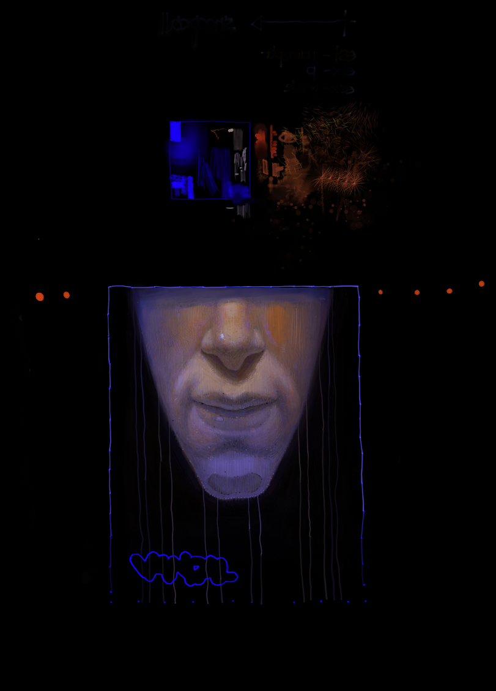

## The Book

****P***roblem Namba 3*, is about a book that all *n* persons want to read,
but everyone can give it only to one of his friends. The question is to find
sequence of passes **such** that everyone recieves the book only once and the last reciever
returns it back to the book owner *(Bobby)*

**T**he second part of the problem follows after finishing with the readings,
the persons have to be divided into *s* *discussion* subgroups ***(!)***
so that each member has no more than *p* enemies. You can view the problem in
detail [**here**](https://ioinformatics.org/files/ioi1989problem3.pdf).
**L**et's start our own discussion with..

## enemy *(e7àTe noBe¼e)*

```Here we have to find all partitions of``` *n* ```people into``` *s*
```subgroups, and than for each partition:```

*k = ( k<sub>1</sub>, k<sub>2</sub>, .., k<sub>s</sub> )*,

```to check all```    

***C<sub>n</sub><sup>k<sub>1</sub></sup>
C<sub>n - k<sub>1</sub></sub><sup>k<sub>2</sub></sup> .. 1***

```combinations.```

```For example if``` *n = 6* ```and``` ***s** = 3*
```than``` ***k*** ```can have three different solutions:```

*(4, 1, 1) (3, 2, 1) (2, 2, 2)*

```iF WE NUMbER ZE PEOPlE fROM``` *0* ```tO``` **5**, ```ANd PiCk thE
2Nd PARtitiON, WE'll hAVE``` *60* ```SUbGROUPS:```

*(0, 1, 2) (3, 4) (5)* **(0, 1, 2) (3, 5) (4)** .. ***(3, 4, 5) (1, 2) (0)***

```WE CAN dO thiS USiNG RECURSiON tEChNiQUES``` *as* **b4**, ```bUt VE``` *hafe* ```tO kNOW hOW tO GENERAtE All```
***partitions*** ```ANd``` **ol** ```COMbiNAtiONS.``` The key *here* is that in both cases the order
doesn't matter, zo to find ze algorithmz we can write them in a dictionary
order (or as they say *lexicographical* but I hate that word it sounds like
**Segmentation Fault**). Once that**z** done it's easy to find the logic.

## friend
*OKAY* I've already got fed up a little bit with all those tree search problems,
so I've decided to write slightly different algorithm with explicit pushing and popping,
like in *Knuth* books. Recall that when high level languages are translated to assembly,
stack frames are created for procedures, where local data is placed. Thus when entering
and exiting a function we have an implicit pushing and popping, it is easier to write
programs in such a way but we are loosing control over the function, for example,
be cos of the program's linkage, it's not so easy to exit a recursive call, we have
to pass back through all created stack frames.

## make no mistake!..
```./book.py 11 4 3 0 1```

..becoz there is no error cking, command arguments are *n, s, k, p, b* where *b* is the
book's owner index, and the others are the same as defined in the problem.
If no arguments are given the program will use its default values. All persons
above 10 are named Dwarf10, Dwarf11, and so on.

```
Reading Time:
Anton_____________ [Bobby, Todor, Han Solo, Dart Vader, Legolas, Harry (the H-Pawn)]
Bobby_____________ [Anton, Todor, Han Solo, Dart Vader, Rand, Legolas, qq, Dwarf10]
Todor_____________ [Bobby, Han Solo, Dart Vader, Legolas, qq, Harry (the H-Pawn), Dwarf10]
Han Solo__________ [Anton, Bobby, Dart Vader, Rand, D'Artagnan, Legolas, Harry (the H-Pawn), Dwarf10]
Dart Vader________ [Anton, Bobby, Todor, Han Solo, Rand, D'Artagnan, qq, Harry (the H-Pawn), Dwarf10]
Rand______________ [Bobby, Todor, Han Solo, Dart Vader, D'Artagnan, Legolas, Harry (the H-Pawn)]
D'Artagnan________ [Anton, Bobby, Todor, Han Solo, Dart Vader, Rand, Legolas, qq, Dwarf10]
Legolas___________ [Bobby, Han Solo, Dart Vader, D'Artagnan, qq, Harry (the H-Pawn)]
qq________________ [Han Solo, Dart Vader, Rand, D'Artagnan, Legolas, Harry (the H-Pawn), Dwarf10]
Harry (the H-Pawn) [Anton, Dart Vader, Rand, D'Artagnan, Legolas, Dwarf10]
Dwarf10___________ [Anton, Todor, Dart Vader, Rand, D'Artagnan, Legolas, qq, Harry (the H-Pawn)]
Bobby Anton
Anton Todor
Todor Han Solo
Han Solo Dart Vader
Dart Vader Rand
Rand D'Artagnan
D'Artagnan qq
qq Harry (the H-Pawn)
Harry (the H-Pawn) Dwarf10
Dwarf10 Legolas
Legolas Bobby
Discussion Time:
Anton_____________ []
Bobby_____________ []
Todor_____________ [Anton, D'Artagnan, qq]
Han Solo__________ [Todor]
Dart Vader________ [Bobby, Todor]
Rand______________ [Anton, Harry (the H-Pawn), Dwarf10]
D'Artagnan________ [Todor, Legolas]
Legolas___________ []
qq________________ [Han Solo, Dart Vader, Dwarf10]
Harry (the H-Pawn) []
Dwarf10___________ [Todor, qq, Harry (the H-Pawn)]
[8, 1, 1, 1]
No Solution
[7, 2, 1, 1]
No Solution
[6, 3, 1, 1]
No Solution
[6, 2, 2, 1]
No Solution
[5, 3, 2, 1]
[Anton, Bobby, Han Solo, D'Artagnan, Harry (the H-Pawn)]
[Todor, Rand, Legolas]
[Dart Vader, Dwarf10]
[qq]
[5, 2, 2, 2]
[Anton, Bobby, Han Solo, D'Artagnan, Harry (the H-Pawn)]
[Todor, Rand]
[Dart Vader, Dwarf10]
[Legolas, qq]
[4, 3, 2, 2]
[Anton, Bobby, Han Solo, D'Artagnan]
[Todor, Rand, Legolas]
[Dart Vader, Dwarf10]
[qq, Harry (the H-Pawn)]
[3, 3, 3, 2]
[Anton, Bobby, Han Solo]
[Todor, Rand, Legolas]
[Dart Vader, D'Artagnan, Dwarf10]
[qq, Harry (the H-Pawn)]
For relaxing times, make it Suntory Time!
```



https://youtu.be/NiuDxl6GU_I
